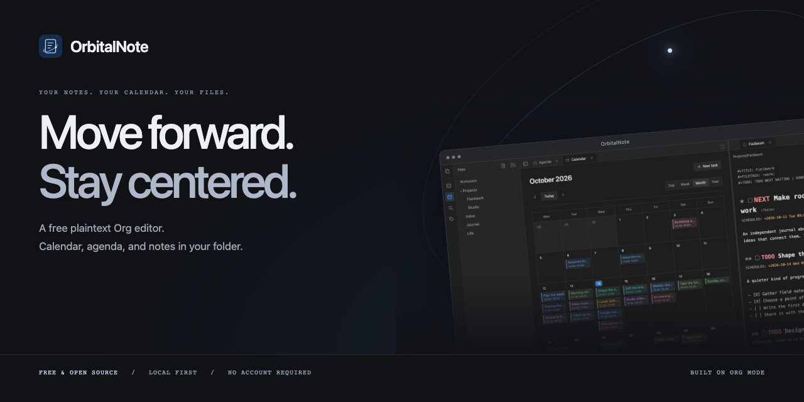

<p align="center"></p>

# OrbitalNote

**Your notes. Your calendar. Your files.**

OrbitalNote is a free, open-source plaintext Org editor with a calendar and agenda.
Your notes are plaintext `.org` files in a folder on your computer. No account
required. Open your existing Org vault, or create your first one without learning
an entire editor configuration first.

[**Download the desktop preview**](https://github.com/mannders00/OrbitalNote/releases)
· [Report an issue](https://github.com/mannders00/OrbitalNote/issues)
· [Contribute](CONTRIBUTING.md)

The client is **GPL-3.0-only**; see [LICENSE](LICENSE), [NOTICE](NOTICE) and the
[name/logo policy](TRADEMARKS.md). Third-party dependencies keep their licenses.

**OrbitalNote Sync is available as a paid preview.** Optional end-to-end encrypted
`.org` note sync is $5/month or $48/year USD, including 1 GB. Create an account and
subscribe through Stripe at [OrbitalNote Sync](https://sync.orbitalnote.org/).
macOS ↔ Android Sync works on real native devices. Local use remains free and
account-free. Attachments and history cleanup are not yet supported.

**Status: desktop and Android preview, with iOS Simulator builds.** Android currently
uses an app-private notebook; linked Android device folders are not available.
Downloads are not yet Apple-notarized or Windows Authenticode-signed. See each
release's notes for platform requirements and the current preview limitations.

## Run the native application

**Apple Silicon testing:** use `bash scripts/build-macos-arm64.sh` on your MacBook,
or double-click `Build for Mac.command` in a source checkout. This creates
an ARM64 `.app` and ZIP with ad-hoc signing. See [Mac testing](docs/macos-testing.md)
for prerequisites and the native test checklist. macOS ARM64 builds are packaged
and verified locally; CI also builds Intel macOS, Windows and Linux packages.

Requirements: Go **1.26+** and the platform's Wails v3 native dependencies.
There is no frontend install/build step and no Node.js requirement.

```sh
# Debian 13 / Ubuntu 24.04 Linux (GTK4 backend)
sudo apt-get install libgtk-4-dev libwebkitgtk-6.0-dev

go run ./app
# Or open an existing workspace immediately:
go run ./app /absolute/path/to/Notes
# Explore the included ordinary Org files:
go run ./app ./examples/Welcome
```

The sample files are editable; use a copy if you want to keep the examples
unchanged. The workspace chooser remembers its last successful folder under the
OS user configuration directory. All note writes happen only in the workspace.

macOS needs Xcode command-line tools. Windows needs the current Wails v3 build
prerequisites and WebView2. See [Wails installation](https://v3.wails.io/quick-start/installation/).
The dependency is pinned to **v3.0.0-beta.25**, not Wails v2.

### Android device testing

With an Android SDK/NDK, Java 21, and a USB-debugging-authorized ARM64 phone:

```sh
bash scripts/build-android.sh --install
```

This builds and installs a standalone debug APK with a persistent **Test Notebook**
on the device. See [Android testing](docs/android-testing.md) for setup and limitations.

### iOS simulator and mobile releases

With Xcode installed, run `bash scripts/build-ios.sh` to create an ARM64 iOS
Simulator bundle. The app launches with a persistent private notebook. Real iPhone
distribution needs Apple signing and TestFlight setup. GitHub Actions produces
Android and iOS Simulator artifacts; see [mobile releases](docs/mobile-releases.md)
for Android release-signing secrets and distribution details.

### Browser development host

Useful for UI development and automated browser checks without a native display:

```sh
go run ./app/dev -workspace ./examples/Welcome
# Open http://127.0.0.1:9240
```

This binds loopback and serves the same frontend and application services. It
checks request Host/Origin and accepts only JSON POST API requests. It is a
development tool, not the hosted sync service. Native builds use Wails'
in-process bridge and do not start this HTTP server.

## Working functionality

- Open an existing folder; recursive collapsible file tree; create notes/folders;
  rename/move notes and folders; confirmed file deletion and empty-folder removal.
- Tabs, fuzzy quick-open, recently opened file paths, command palette, light/dark/
  system appearance, responsive navigation, outline, properties and local backlinks.
- Compact neutral-gray UI with a blue accent; independently collapsible sidebars,
  persistent desktop layout preferences, and dismissible drawers on narrow screens.
- Actual Org source editing with a locally bundled CodeMirror editor and undo;
  heading sizes, bold/italic/underline/strike markup with literal source markers,
  and clickable heading task checkboxes. Only the TODO keyword is colored red;
  soft word wrap and a book/pencil button to toggle reading and editing. Edits
  auto-save after a 600 ms typing pause, preserving untouched source and mixed
  line endings. Cmd/Ctrl S saves immediately; wrapping never inserts newlines.
- Files, Agenda, Calendar, Search, Tags and Settings stay open as closable tabs.
  Drag a tab to a pane edge to split left/right or above/below; drop in the middle
  or onto a tab strip to move it into that group. Drag dividers to resize. Tabs and
  split layouts are restored per workspace. Calendar and Agenda refresh after
  auto-saves, so they can remain visible beside the note you are editing.
- Optional Vi mode in Settings: Normal/Insert/Visual modes, h/j/k/l, word and line
  motions, Ctrl D/U half-page navigation, counts, delete/change/yank, paste,
  undo/redo and literal search in an app-styled dialog.
  This is a basic binding layer, not a full Vim implementation (no Ex
  commands, macros, named registers or plugins). Cmd/Ctrl S still saves.
- On macOS, the native title bar uses the editor background and follows in-app
  light/dark changes. Other platforms currently retain native title-bar styling.
- Preview through `go-org`: headings, inline markup, lists/checkboxes, tables,
  quotes, source blocks, rules, timestamps, TODOs, tags and property drawers.
  Chroma highlights source blocks. Local PNG/JPEG/GIF/WebP images load through the
  confined filesystem service. External links open in the system browser.
- Search filenames and source text, including headings, TODO states, tags and
  properties; results jump to source lines. Tag browsing includes headings and
  `#+FILETAGS`, including files without headings. Counts include each heading tag
  occurrence and each file-level tag once per file.
- Tags offers eight cohesive colors with stable automatic defaults and per-workspace,
  device-local overrides. Agenda and month events use the first heading tag, then
  the first file tag as fallback; day/week agenda lists use the same colors.
- Drag files or folders in the file tree onto a folder or the Workspace root row
  to move them on disk. Open tabs retain unsaved edits and follow the new paths.
  Existing destinations are rejected. This is internal tree dragging, not OS file import.
- Agenda: today, upcoming, overdue and all tasks; filter by planning type, file,
  tag or state. Completed tasks are excluded. Entries navigate to source headings.
- Calendar: day/week time grids, month grid and year overview. Optional start/end
  times produce duration-sized, overlap-aware blocks backed by Org timestamps
  such as `<2026-09-26 09:00-10:30>`. Completed events remain visible with
  strikethrough. Click a time slot to schedule a task; drag simple non-repeating
  events between month cells to modify their actual source dates.
- Alt T opens task details for the selected heading, preserving its body, tags,
  priority and children. The shared task dialog has an app-styled date picker
  and optional 24-hour start/end times; an end time must be later on the same day.
- Cmd/Ctrl 1–9 selects a tab in the focused pane. Tabs and sidebar controls share
  the top bar. macOS press-and-hold character previews and automatic text
  corrections are disabled for this application.
- Structured heading/subtree promotion, demotion and sibling movement; configured
  TODO cycling; schedule/deadline edits; timestamp/link insertion; checkbox and
  indentation commands. Commands splice source rather than rewriting an AST.
- Recursive fsnotify watching, debounce, atomic-save handling and a 30-second
  reconciliation fallback. Rename/move becomes an updated index/tree.
- SHA-256 revision checks, same-directory temporary writes, file flush and rename,
  preserved permissions, symlink/path confinement. Stale saves/deletes fail without
  overwriting the external version. Dirty tabs offer save-copy/reload resolution.
- Native quit flushes pending auto-saves; conflicts or failed saves retain the
  buffer and require confirmation before discarding edits on quit or tab close.

### Keyboard

| Action | Shortcut |
|---|---|
| Save | Ctrl / Cmd S |
| Quick open | Ctrl / Cmd K |
| Command palette | Ctrl / Cmd Shift P |
| New note | Ctrl / Cmd N |
| Toggle left / right sidebar | Ctrl / Cmd Shift L / R |
| New heading | Alt Enter |
| Promote / demote subtree | Alt Left / Right |
| Move subtree | Alt Up / Down |
| Edit task at selected heading | Alt T |
| Select tab in focused pane | Ctrl / Cmd 1–9 |
| Indent / outdent | Tab / Shift Tab in source |

All editor commands are also available through the mouse-accessible command
palette. Scheduling, deadlines, timestamps and links use dialogs.

## Boundaries and known limitations

- Repeaters are parsed, preserved and displayed, **not expanded or automatically
  advanced**. Complex Org agenda semantics, diary expressions and inherited
  settings are not implemented. Calendar resizing is not implemented.
- No Babel/Lisp execution, remote includes, raw executable HTML, automatic remote
  image fetching, LaTeX typesetting, encrypted-subtree editing or custom exporters.
  Unknown source stays intact; preview may omit unsupported constructs.
- Only UTF-8 notes up to 8 MiB are editable. go-org has a 64 KiB per-line parser
  limit; affected files remain accessible as source with a preview fallback.
- Hidden directories/files and symlinks are not indexed. Backlinks currently
  resolve relative file paths, not Org ID links. Link targets are not rewritten
  automatically when files move. External renames do not automatically retarget
  an already-open tab; its buffer is retained for explicit resolution.
- No durable crash-recovery journal or version-history UI yet. The frontend checks
  index version once per second; large-workspace performance has not been profiled.
- Revision rechecks cannot provide atomic compare-and-swap against uncooperative
  external processes on a normal filesystem. There remains a small check/rename
  race. File-provider/mobile atomicity needs separate implementation and tests.
- Responsive layout and an Android private-notebook preview are implemented;
  **linked iOS/Android device folders are not**.
  Upstream mobile pickers import copies and do not meet linked-folder requirements.
- Installer integration, signing/notarization, auto-update, screen-reader auditing,
  comprehensive mobile device testing and release performance gates remain open.

Use your preferred external editor or filesystem sync tool with the workspace.
On external changes, clean tabs reload and dirty tabs retain their buffers.
Hosted sync is a separate, optional convenience, maintained independently
of this GPL client. It is not needed to build or use OrbitalNote.

## Checks

```sh
bash scripts/check.sh
# Headless core tests without GTK:
go test ./internal/...
# On a supported machine:
go test -race ./internal/...
# Optional JavaScript source-preservation tests:
bun test app/ui/editor.test.js
# Actual native WebView / Go bridge integration check on Linux:
xvfb-run -a go run ./scripts/native-smoke ./examples/Welcome
```

`scripts/browser-smoke.mjs` tests editing/saving, dirty conflicts, reload, preview,
search, calendar views, quick-open, dark appearance and narrow layouts using
Playwright against the dev host and a disposable example copy. Playwright is a
development-only tool; it is not an application dependency. Setup is documented
at the top of that script.

CI runs Go core tests with the race detector on Linux x86-64, verifies the editor
bundle, and compiles the native application on Linux, macOS and Windows.

## Unsigned local packaging

```sh
bash scripts/package-local.sh
```

Produces a native preview artifact under `bin/`, plus third-party license files.
Linux artifacts require compatible GTK4/WebKitGTK libraries; they are not
universal static executables. macOS packages are ad-hoc-signed `.app` bundles;
Windows packages require WebView2. These are preview builds, not notarized or
Authenticode-signed releases.

## Layout and dependencies

```text
app/                  Wails v3 host, embedded vanilla frontend, dev host
internal/orgdoc/       Existing Org parser + safe rendering/source edits
internal/orgdate/      Civil dates, times, ranges and repeater metadata
internal/workspace/    Confined disk store, index, watchers and services
docs/                 Architecture, staged roadmap and mobile feasibility gate
scripts/              Checks, native/browser probes, unsigned packaging
examples/             Ordinary sample Org workspace
```

Direct dependencies are deliberately focused: Wails v3 (native host), go-org
(mature Org parsing/rendering), fsnotify (filesystem events), bluemonday (HTML
sanitization), Chroma (source-block highlighting), and Go's x/net HTML parser
(inert image rewriting). CodeMirror is bundled locally for source editing; there
are no CDN scripts or frontend framework dependencies.

Start with [architecture](docs/architecture.md), [delivery stages](docs/roadmap.md),
and the [mobile feasibility gate](docs/mobile-feasibility.md).
