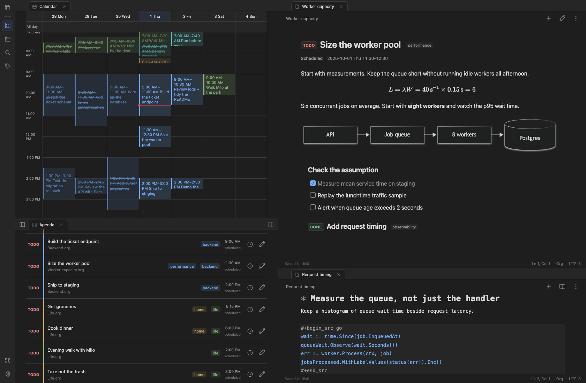
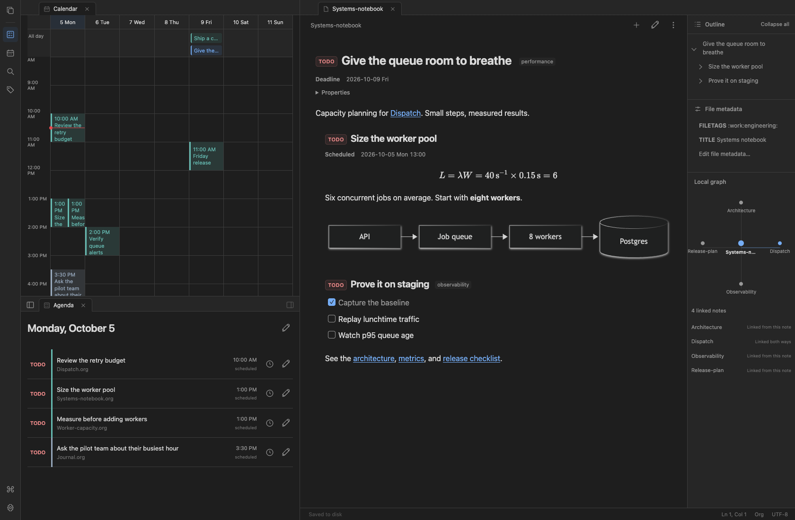
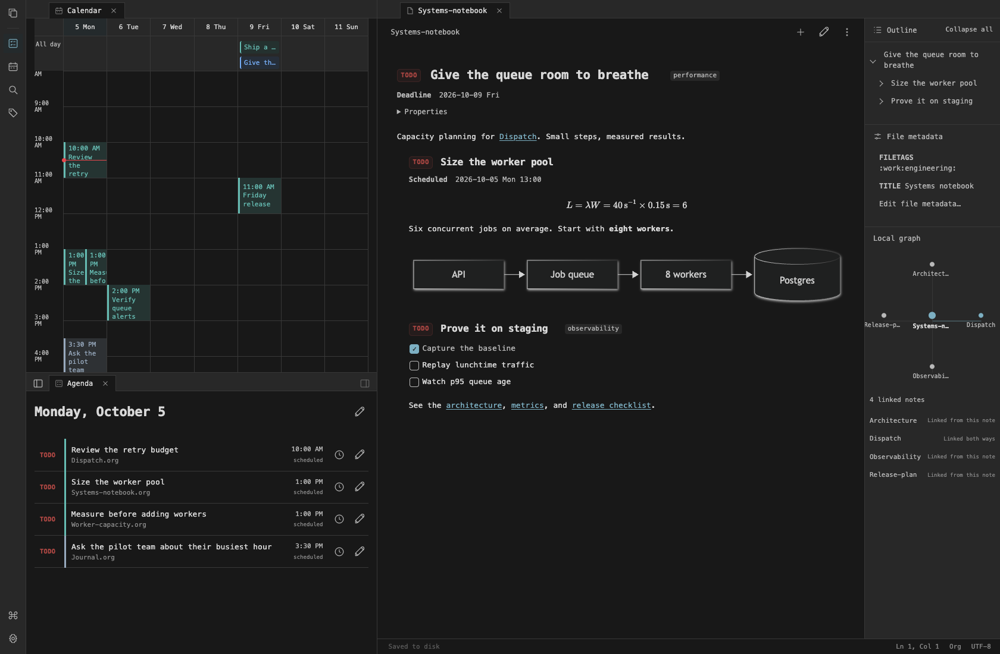
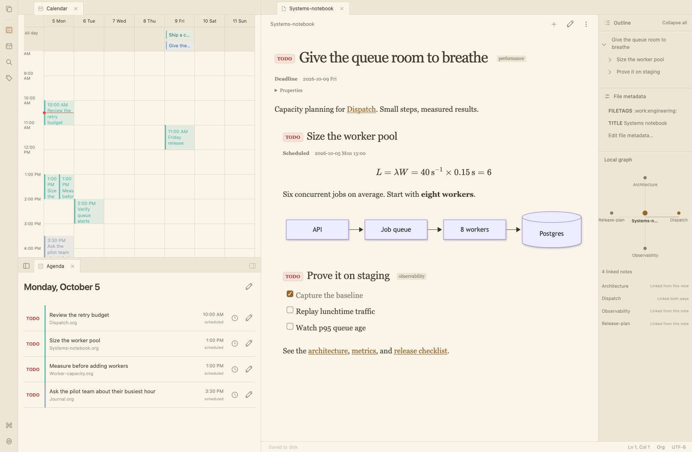

<p align="center"></p>

# OrbitalNote

[What's new in preview.17](CHANGELOG.md)

[Ask a question](https://github.com/mannders00/OrbitalNote/discussions) ·
[Request an improvement](https://github.com/mannders00/OrbitalNote/issues/new?template=improvement.yml) ·
[Report a bug](https://github.com/mannders00/OrbitalNote/issues/new?template=bug.yml) ·
[Project board](https://github.com/users/mannders00/projects/1) ·
[Roadmap and work history](docs/roadmap.md) · [Contribute](CONTRIBUTING.md)

**Org mode. A modern interface.**

OrbitalNote is a polished, free, open-source Org client for desktop and mobile.
Notes, tasks, and a visual calendar, built on your own `.org` files.
Open your existing Org folder or start fresh. No Emacs required.

Work offline without an account. Add optional end-to-end encrypted Sync to
keep your desktop and phone together.

**Still in preview, with working native apps.** Notes, editing, calendar,
agenda, and encrypted Sync are available now. macOS ↔ Android Sync has been
tested on real devices.

[**Get OrbitalNote**](https://orbitalnote.org/#download)
· [**Get Sync**](https://sync.orbitalnote.org/signup)
· [See the website](https://orbitalnote.org/)
· [Talk on Discord](https://discord.gg/TdXgh69gwP)

## Download and try it

The app is free. These are direct downloads for **0.1.0-preview.20**, including
task clocks, repeating tasks, interactive checklists, and encrypted Sync.

| Your device | Download | Getting started |
|---|---|---|
| Mac with Apple Silicon | [Download for Mac](https://github.com/mannders00/OrbitalNote/releases/download/v0.1.0-preview.20/orbitalnote-0.1.0-preview.20-darwin-arm64.zip) | M1 or newer. Unzip and move the app to Applications. |
| Intel Mac | [Download for Intel Mac](https://github.com/mannders00/OrbitalNote/releases/download/v0.1.0-preview.20/orbitalnote-0.1.0-preview.20-darwin-amd64.zip) | Unzip and move the app to Applications. |
| Windows | [Download for Windows](https://github.com/mannders00/OrbitalNote/releases/download/v0.1.0-preview.20/orbitalnote-0.1.0-preview.20-windows-amd64.zip) | x64. Extract the ZIP and open OrbitalNote.exe. Requires WebView2. |
| Linux | [Download for Linux](https://github.com/mannders00/OrbitalNote/releases/download/v0.1.0-preview.20/orbitalnote-0.1.0-preview.20-linux-amd64.tar.gz) | x64, Ubuntu 24.04-compatible. Requires GTK4 and WebKitGTK 6.0. |
| Android | [Download the APK](https://github.com/mannders00/OrbitalNote/releases/download/v0.1.0-preview.20/orbitalnote-0.1.0-preview.20-android-arm64.apk) | Android 7+, ARM64. Open the APK and allow installation from your browser. |

macOS builds aren't notarized yet; you may need to allow the app in System
Settings → Privacy & Security after the first launch attempt. Windows builds
aren't Authenticode-signed yet and may show a SmartScreen prompt.

**iPhone and iPad:** the app builds and opens in the iOS simulator. An installable
iPhone preview is still to come. Android is available now.

[Release notes and checksums](https://github.com/mannders00/OrbitalNote/releases/tag/v0.1.0-preview.20)
· [Find the newest downloads](https://orbitalnote.org/#download)

## What's here today

### Write, then get out of your own way

Write in a formatted Org editor, or switch to reading preview. Notes save as you
work. Headings, lists, checkboxes, tables, code blocks, and local images all have
a place. Your source stays plaintext, so you can open it in another editor too.

Already using Org with Emacs? Open your existing folder. There's no import or
conversion step. New to Org? Start with a note or the calendar and learn the
format as you go.

### See your day next to your notes

Keep the agenda or calendar beside the note you're working on. Drag a tab to
split the window, resize the panes, and make the workspace yours.

- **Agenda:** today, upcoming, overdue, and all tasks. Check a task off right
  there and its Org heading changes to the done state.
- **Calendar:** day, week, month, and year views. Schedule a task, give it a time,
  or drag a simple event to another day. The actual Org timestamp updates.
- **Live updates:** edit a note and see its tasks update in the other pane.

### Find things without losing your place

Search your notes, browse tags, jump through headings, or use quick-open to get
back to a file. Keep multiple notes open in tabs. Light and dark themes,
collapsible sidebars, keyboard shortcuts, and optional Vi controls are included.

### Make it yours

The same real workspace in **Default**, **Terminal**, and **Editorial**. These
captures show preview.17's nested tasks, LaTeX, Mermaid, Calendar,
Agenda, and local note graph. Click an image to see it full-size.

| Default (Workbench) | Terminal | Editorial |
| --- | --- | --- |
| [](docs/assets/themes/default.png) | [](docs/assets/themes/terminal.png) | [](docs/assets/themes/editorial.png) |
| Balanced, neutral, and focused. | Base16-inspired colors and dense monospace. | Warm paper and expressive serif headings. |

Every built-in theme includes **light and dark palettes**, with an option to
follow your system. You can also **[create your own CSS theme](docs/themes.md)**.
Explore the screenshots' Org files in [examples/Connected](examples/Connected).

## Start on your desktop. Pick it up on your phone.

Plan something at your desk, walk away,
open OrbitalNote on your phone later, and check it off. Come back to your desktop
and the note reflects what you did.

**OrbitalNote Sync is live as a paid preview.** It's end-to-end encrypted and
works across desktop and mobile. Updates happen automatically while the apps
are open and connected. Android catches up when you reopen it; it doesn't yet
sync while the app is closed.

- **$5/month or $48/year USD** ($4/month when billed yearly).
- **1 GB**, including retained encrypted revision history.
- One workspace of `.org` notes in this preview.
- Subscribe through Stripe. Manage or cancel from your account.

Download the app, [create your Sync account](https://sync.orbitalnote.org/signup),
then open **Settings → OrbitalNote Sync**. Connect your first workspace and save
its recovery key. Use that key to connect your other device.

The app connects to OrbitalNote automatically; there is no server URL to enter.
Choose **Sign in to OrbitalNote**, approve the device code in your browser, and
return to the app. Sign-in finishes automatically.

[**Get Sync preview**](https://sync.orbitalnote.org/signup)
· [Try the simulated desktop/phone demo](https://orbitalnote.org/#sync)
· [Manage your account](https://sync.orbitalnote.org/)

The app stays free and works offline without a subscription. Hosted Sync is
optional. Attachments and history cleanup aren't available yet.

## A preview, with room to grow

Feedback and contributions help shape the next release.
Current preview limits:

- Android uses a private app notebook. Linking an existing device folder isn't
  implemented yet. Updates preserve the notebook; uninstalling the app deletes it.
- Org repeaters advance on completion; recorded completions appear in Calendar.
  Multi-day repeating ranges still require source editing.
- This isn't a complete Emacs or Org agenda implementation. There's no Babel
  execution, and some advanced Org constructs won't appear in reading preview.
- iPhone distribution, desktop notarization, and automatic app updates are still
  ahead. Don't buy Sync for iPhone expecting an installable app today.

Found something? [Open an issue](https://github.com/mannders00/OrbitalNote/issues).
Want to talk through an idea? [Join the Discord](https://discord.gg/TdXgh69gwP)
or email [matt@masoftware.net](mailto:matt@masoftware.net).

## Open source, ordinary files

The native client is **GPL-3.0-only**. You can read it, build it, and contribute.
Your notes stay ordinary `.org` files, and the hosted Sync service isn't required
to build or use the app.

[Contributing](CONTRIBUTING.md) · [License](LICENSE) · [Third-party notices](NOTICE)
· [Name and logo policy](TRADEMARKS.md)

## Building and technical details

<details>
<summary>Build from source, explore the full feature list, and run checks</summary>

### Run the native application

**Apple Silicon testing:** use `bash scripts/build-macos-arm64.sh` on your MacBook,
or double-click `Build for Mac.command` in a source checkout. This creates
an ARM64 `.app` and ZIP with ad-hoc signing. See [Mac testing](docs/macos-testing.md)
for prerequisites and the native test checklist. macOS ARM64 builds are packaged
and verified locally; CI also builds Intel macOS, Windows and Linux packages.

Requirements: Go **1.26+** and the platform's Wails v3 native dependencies.
There is no frontend install/build step and no Node.js requirement.

```sh
# Debian 13 / Ubuntu 24.04 Linux (GTK4 backend)
sudo apt-get install libgtk-4-dev libwebkitgtk-6.0-dev

go run ./app
# Or open an existing workspace immediately:
go run ./app /absolute/path/to/Notes
# Explore the included ordinary Org files:
go run ./app ./examples/Welcome
```

The sample files are editable; use a copy if you want to keep the examples
unchanged. The workspace chooser remembers its last successful folder under the
OS user configuration directory. All note writes happen only in the workspace.

macOS needs Xcode command-line tools. Windows needs the current Wails v3 build
prerequisites and WebView2. See [Wails installation](https://v3.wails.io/quick-start/installation/).
The dependency is pinned to **v3.0.0-beta.25**, not Wails v2.

### Android device testing

With an Android SDK/NDK, Java 21, and a USB-debugging-authorized ARM64 phone:

```sh
bash scripts/build-android.sh --install
```

This builds and installs a standalone debug APK with a persistent **Test Notebook**
on the device. See [Android testing](docs/android-testing.md) for setup and limitations.

### iOS simulator and mobile releases

With Xcode installed, run `bash scripts/build-ios.sh` to create an ARM64 iOS
Simulator bundle. The app launches with a persistent private notebook. Real iPhone
distribution needs Apple signing and TestFlight setup. GitHub Actions produces
Android and iOS Simulator artifacts; see [mobile releases](docs/mobile-releases.md)
for Android release-signing secrets and distribution details.

### Browser development host

Useful for UI development and automated browser checks without a native display:

```sh
go run ./app/dev -workspace ./examples/Welcome
# Open http://127.0.0.1:9240
```

This binds loopback and serves the same frontend and application services. It
checks request Host/Origin and accepts only JSON POST API requests. It is a
development tool, not the hosted sync service. Native builds use Wails'
in-process bridge and do not start this HTTP server.

## Working functionality

- Open an existing folder; recursive collapsible file tree; create notes/folders;
  rename/move notes and folders; confirmed file deletion and empty-folder removal.
- Tabs, fuzzy quick-open, recently opened file paths, command palette, light/dark/
  system appearance, responsive navigation, outline, properties and local backlinks.
- Compact neutral-gray UI with a blue accent; independently collapsible sidebars,
  persistent desktop layout preferences, and dismissible drawers on narrow screens.
- Actual Org source editing with a locally bundled CodeMirror editor and undo;
  heading sizes, bold/italic/underline/strike markup with literal source markers,
  and clickable heading task checkboxes. Only the TODO keyword is colored red;
  soft word wrap and a book/pencil button to toggle reading and editing. Edits
  auto-save after a 600 ms typing pause, preserving untouched source and mixed
  line endings. Cmd/Ctrl S saves immediately; wrapping never inserts newlines.
- Files, Agenda, Calendar, Search, Tags and Settings stay open as closable tabs.
  Drag a tab to a pane edge to split left/right or above/below; drop in the middle
  or onto a tab strip to move it into that group. Drag dividers to resize. Tabs and
  split layouts are restored per workspace. Calendar and Agenda refresh after
  auto-saves, so they can remain visible beside the note you are editing.
- Optional Vi mode in Settings: composed motions/counts, text objects (`ciw`,
  `di"`, `yap`), linewise selection, dot-repeat, character finds, undo/redo,
  heading folds, and basic macros (`qa…q`, `@a`, `@@`, `3@a`). `/` and `?`
  search from a bottom prompt; `n`/`N` repeat. Cmd/Ctrl S still saves.
- Cmd/Ctrl F opens the bottom find/replace bar, with or without Vi mode.
  Includes regex capture replacements (`$1`, `$2`, `$&`), match navigation,
  case/whole-word options, and replacement limited to a captured selection.
  See the [editing reference](docs/editing.md) for keys and supported behavior.
- On macOS, the native title bar uses the editor background and follows in-app
  light/dark changes. Other platforms currently retain native title-bar styling.
- Preview through `go-org`: headings, inline markup, lists/checkboxes, tables,
  quotes, source blocks, rules, timestamps, TODOs, tags and property drawers.
  Chroma highlights source blocks. Local PNG/JPEG/GIF/WebP images load through the
  confined filesystem service. External links open in the system browser.
- Search filenames and source text, including headings, TODO states, tags and
  properties; results jump to source lines. Tag browsing includes headings and
  `#+FILETAGS`, including files without headings. Counts include each heading tag
  occurrence and each file-level tag once per file.
- Tags offers eight cohesive colors with stable automatic defaults and per-workspace,
  device-local overrides. Agenda and month events use the first heading tag, then
  the first file tag as fallback; day/week agenda lists use the same colors.
- Drag files or folders in the file tree onto a folder or the Workspace root row
  to move them on disk. Open tabs retain unsaved edits and follow the new paths.
  Existing destinations are rejected. This is internal tree dragging, not OS file import.
- Agenda: today, upcoming, overdue and all tasks; filter by planning type, file,
  tag or state. Mark tasks done directly, respecting custom TODO sequences.
  Completed tasks are excluded. Entries navigate to source headings.
- Calendar: day/week time grids, month grid and year overview. Optional start/end
  times produce duration-sized, overlap-aware blocks backed by Org timestamps
  such as `<2026-09-26 09:00-10:30>`. Completed events remain visible with
  strikethrough. Click a time slot to schedule a task; drag simple non-repeating
  events between month cells to modify their actual source dates.
- Alt T opens task details for the selected heading, preserving its body, tags,
  priority and children. The shared task dialog has an app-styled date picker
  and optional 24-hour start/end times; an end time must be later on the same day.
- Cmd/Ctrl 1–9 selects a tab in the focused pane. Tabs and sidebar controls share
  the top bar. macOS press-and-hold character previews and automatic text
  corrections are disabled for this application.
- Structured heading/subtree promotion, demotion and sibling movement; configured
  TODO cycling; schedule/deadline edits; timestamp/link insertion; checkbox and
  indentation commands. Commands splice source rather than rewriting an AST.
- Recursive fsnotify watching, debounce, atomic-save handling and a 30-second
  reconciliation fallback. Rename/move becomes an updated index/tree.
- SHA-256 revision checks, same-directory temporary writes, file flush and rename,
  preserved permissions, symlink/path confinement. Stale saves/deletes fail without
  overwriting the external version. Dirty tabs offer save-copy/reload resolution.
- Native quit flushes pending auto-saves; conflicts or failed saves retain the
  buffer and require confirmation before discarding edits on quit or tab close.

### Keyboard

| Action | Shortcut |
|---|---|
| Save | Ctrl / Cmd S |
| Find file | Ctrl / Cmd O |
| Run command | Ctrl / Cmd P |
| Settings | Ctrl / Cmd , |
| New note | Ctrl / Cmd N |
| Toggle left / right sidebar | Ctrl / Cmd Shift L / R |
| New heading | Alt Enter |
| Promote / demote subtree | Alt Left / Right |
| Move subtree | Alt Up / Down |
| Edit task at selected heading | Alt T |
| Select tab in focused pane | Ctrl / Cmd 1–9 |
| Close focused tab | Ctrl / Cmd W |
| Indent / outdent | Tab / Shift Tab in source |

All editor commands are also available through the mouse-accessible command
palette. Scheduling, deadlines, timestamps and links use dialogs.
Application shortcuts can be reassigned or cleared in Settings → Keyboard shortcuts.
The palette and button hints reflect your saved bindings. Use the heading chevrons
or the palette's fold/unfold commands to collapse a heading and its subtree in
editing or reading mode. Folding changes only the view, never the Org source.

## Boundaries and known limitations

- Repeaters are parsed, preserved and displayed, **not expanded or automatically
  advanced**. Complex Org agenda semantics, diary expressions and inherited
  settings are not implemented. Calendar resizing is not implemented.
- No Babel/Lisp execution, remote includes, raw executable HTML, automatic remote
  image fetching, LaTeX typesetting, encrypted-subtree editing or custom exporters.
  Unknown source stays intact; preview may omit unsupported constructs.
- Only UTF-8 notes up to 8 MiB are editable. go-org has a 64 KiB per-line parser
  limit; affected files remain accessible as source with a preview fallback.
- Hidden directories/files and symlinks are not indexed. Backlinks currently
  resolve relative file paths, not Org ID links. Link targets are not rewritten
  automatically when files move. External renames do not automatically retarget
  an already-open tab; its buffer is retained for explicit resolution.
- No durable crash-recovery journal or version-history UI yet. The frontend checks
  index version once per second; large-workspace performance has not been profiled.
- Revision rechecks cannot provide atomic compare-and-swap against uncooperative
  external processes on a normal filesystem. There remains a small check/rename
  race. File-provider/mobile atomicity needs separate implementation and tests.
- Responsive layout and an Android private-notebook preview are implemented;
  **linked iOS/Android device folders are not**.
  Upstream mobile pickers import copies and do not meet linked-folder requirements.
- Installer integration, signing/notarization, auto-update, screen-reader auditing,
  comprehensive mobile device testing and release performance gates remain open.

Use your preferred external editor or filesystem sync tool with the workspace.
On external changes, clean tabs reload and dirty tabs retain their buffers.
Hosted sync is a separate, optional convenience, maintained independently
of this GPL client. It is not needed to build or use OrbitalNote.

## Checks

```sh
bash scripts/check.sh
# Headless core tests without GTK:
go test ./internal/...
# On a supported machine:
go test -race ./internal/...
# Optional JavaScript source-preservation tests:
bun test app/ui/editor.test.js
# Actual native WebView / Go bridge integration check on Linux:
xvfb-run -a go run ./scripts/native-smoke ./examples/Welcome
```

`scripts/browser-smoke.mjs` tests editing/saving, dirty conflicts, reload, preview,
search, calendar views, quick-open, dark appearance and narrow layouts using
Playwright against the dev host and a disposable example copy. Playwright is a
development-only tool; it is not an application dependency. Setup is documented
at the top of that script.

CI runs Go core tests with the race detector on Linux x86-64, verifies the editor
bundle, and compiles the native application on Linux, macOS and Windows.

## Unsigned local packaging

```sh
bash scripts/package-local.sh
```

Produces a native preview artifact under `bin/`, plus third-party license files.
Linux artifacts require compatible GTK4/WebKitGTK libraries; they are not
universal static executables. macOS packages are ad-hoc-signed `.app` bundles;
Windows packages require WebView2. These are preview builds, not notarized or
Authenticode-signed releases.

## Layout and dependencies

```text
app/                  Wails v3 host, embedded vanilla frontend, dev host
internal/orgdoc/       Existing Org parser + safe rendering/source edits
internal/orgdate/      Civil dates, times, ranges and repeater metadata
internal/workspace/    Confined disk store, index, watchers and services
docs/                 Architecture, staged roadmap and mobile feasibility gate
scripts/              Checks, native/browser probes, unsigned packaging
examples/             Ordinary sample Org workspace
```

Direct dependencies are deliberately focused: Wails v3 (native host), go-org
(mature Org parsing/rendering), fsnotify (filesystem events), bluemonday (HTML
sanitization), Chroma (source-block highlighting), and Go's x/net HTML parser
(inert image rewriting). CodeMirror is bundled locally for source editing; there
are no CDN scripts or frontend framework dependencies.

Start with [architecture](docs/architecture.md), [delivery stages](docs/roadmap.md),
and the [mobile feasibility gate](docs/mobile-feasibility.md).

</details>
