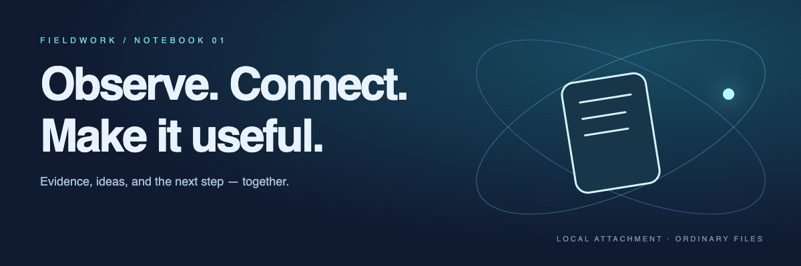

#+TITLE: Fieldwork · First-run study
#+FILETAGS: :research:product:

* A calmer first five minutes
*Question:* can a shorter setup help people reach their first useful note?
Keep the /evidence/, the experiment, and the next action in one place.

** The signal so far
42 of 60 participants created a note. Our baseline completion rate is
\(p = \frac{42}{60} = 70\%\). Next target: *85%*, without adding more guidance.

#+begin_src python
completed, participants = 42, 60
completion = completed / participants
print(f"First note created: {completion:.0%}")
#+end_src

** TODO Test a shorter setup :experiment:
SCHEDULED: <2026-09-29 Tue 14:00-15:00>
- [X] Review the interview notes
- [ ] Remove the optional profile step
- [ ] Run five follow-up sessions

See [[file:02 Fieldwork.org][the project plan]] for this week's review and writing deadlines.
